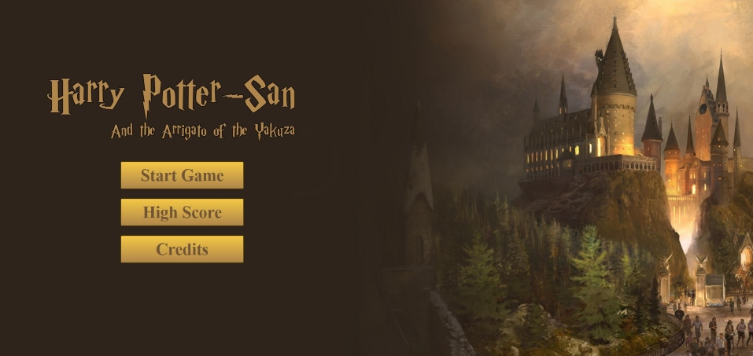
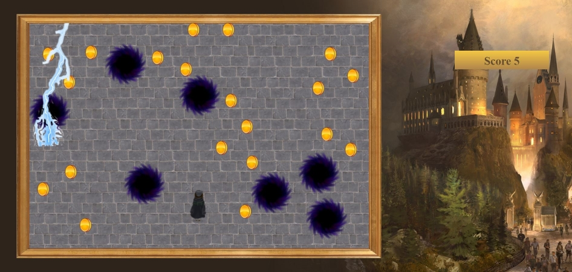
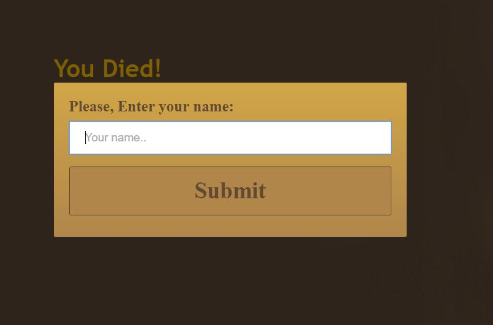
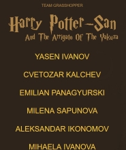

#Harry Potter-San
  

JavaScript UI and DOM | Team 'Grasshopper' |  Client-side JavaScript Game using HTML5 canvas

### Harry Potter-San And the Arrigato of the Yakuza
This game was created as part of the teamwork assignment for the course JavaScript UI and DOM  (March 2017) at Telerik Academy by Team 'Grasshopper'. The game uses native DOM manipulations to create, show and hide its menu, score table and canvas. The field was visualized using [HTML5] (https://developer.mozilla.org/en-US/docs/Web/API/Canvas_API). 

The game tells the story of Harry Potter. Harry was still madly in love in Hermione and decided to try a new potion to make him more attractive. However, during the mixing process something went terribly wrong. Now Harry looks a bit Asian and is in the basement of Hogwarts. The only way out is to collect enough coins and use them to escape. There are some obstacles getting in his way. 

The game is to be further developed by adding features like:
* Bolts should appear from every side
* More collectable objects
* Another character chasing Harry 
* Moving background

### Team Members
The following team members were randomly chosen to participate in the team project assignment as **Team 'Grasshopper'**:

| Name                | *Username*           |
| --------------------| ---------------------|
| Yasen Ivanov        | *yasen.ivanov.921*   |
| Milena Sapunova     | *milena.aleksandrova*|
| Cvetozar Kalchev    | *Cvetozar_Kalchev*   |
| Emilian Panagyurski | *EmiliyanPanagyurski*|
| Aleksandar Ikonomov | *a.ikonomov*         |
| Mihaela Ivanova     | *Mihaela_Ivanova*    |
| Plamen Lakov        | *p_lakov*            |

### Project Purpose:
Following a team meeting and carefull consideration of our ideas, all team members agreed to fulfill the team project requirements by creating a Harry Potter game. First, a main menu is prompting the user to choose from three options: Play, High Score and Credits. After choosing play one can see the canvas and the main character at the bottom. Around him there coins, holes and bolts. Using the arrow keys of the keyboard the player can navigate his way around the field. The player can collect coins, which will increase his overall score. On the other hand, if Harry gets too close to the holes he can get sucked inside and die. If he gets hit by a bolt, he dies as well. 

### Screenshots		   

 
  
 
 
### URL to repository
[**Link to YouTube video**]
(https://www.youtube.com/watch?v=8CXwSBUuxxY&feature=youtu.be)
